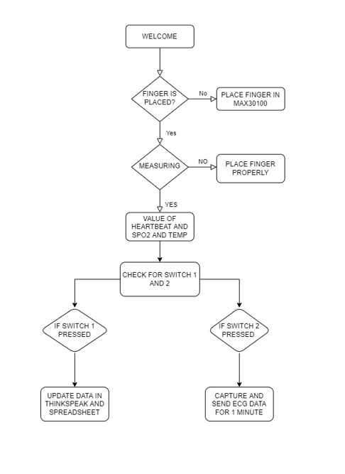

# Smart Healthcare Monitoring  System 
## VAIDYARU HEALTH+

### Introduction:
VAIDYARU HEALTH+ is the ALL-IN-ONE smart healthcare system, developed with an aim to provide ease of convinience monitoring of vital functions of
a human body such as ECG Electrocardiogram, SPO2 levels, Temperature and Heartbeat The system very efficiently enables an individual to know about their health,
at any time of need and provides the essentials that they require at once. Further it analyses a body's current health parameters and displays them alongside 
recording and uploading the data to server, constant monitoring of data helps in indicating early anomalies and caution the patient of situations such as
Cardiac Arrest or Paralysis. It is a compact and convinient device and can used by people from age all groups very efficiently.  
It has Following Features:
1. HeartBeat Detection 
2. SPO2 Level detection
3. Body temperature Detection
4. Air Quality Index Detection 
5. Room Temperature Detection
6. ECG Detection

## Hardware used:
1. Arduino Nano
2. MAX30100 Pulse Oximeter Sensor
3. LCD Display(16*2) with I2C module
4. AD8232 ECG Sensor
5. DS18B20 Bodytemperature Sensor
6. LM35 Temperature Sensor
7. MQ135 Air Quality Sensor
8. ESP8266 Wifi Module
9. Power supply components( TP4056 Charging Module,two 3.7 v Cell,7805 Voltage Regulator Circuit)

## Working: 
It works on two modes that can be operated using switches.
1. Normal (Pulse,Sp02, Temp and AQI Detection )
2. ECG Detection (It Detects ECG value for Continous 1 Minute)
### Normal-
 In this Mode the device Detects the value of HeartBeat, SP02, Body Temperature, AQI, Room Temperature and shows on LCD Screen and on Pressing Button it directly sends the data to thinkspeak cloud and the reading get updates on spreadsheet. 
### ECG Mode-
 On Pressing the Button 2 The device goes in ECG Mode in this it measures the value of ecg for a continous 1 minute and displays all ecg values to the lcd screen as well as send all the data to thinkspeak cloud and plots a ecg graph on thinkspeak.

## FLOW CHART

## CIRCUIT BLUEPRINT 

## HARDWARE DEVICE
  
   
 
          
          

## PRODUCT OPERATION SCREENSHOTS
  
  
  
  
  
  
  
  

